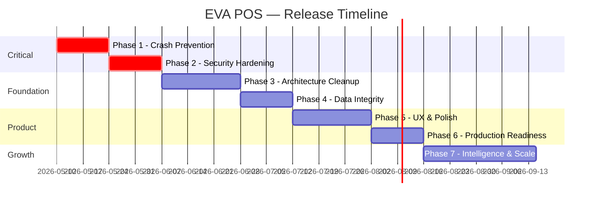

# EVA POS — CTO Execution Roadmap
### Version 2.0.8 → Production-Ready Commercial Release

> **Audit Date:** May 8, 2026  
> **Audited By:** Antigravity Deep Codebase Analysis  
> **Codebase:** Electron 28 + React 18 + SQLite3 + TypeScript  
> **Total Files Audited:** ~120 source files across electron/, renderer/, and config  
> **Database Layer:** 3,868 lines in a single `database.ts` monolith (113 KB)

---

## Executive Summary

EVA POS is a functional, feature-rich desktop POS system already in production use. However, the architecture has several critical single-points-of-failure that **will** cause data loss or security breaches at scale. This roadmap prioritizes stabilization and security before any new features.



---

## Phase 1: Crash Prevention & Runtime Safety ✅ COMPLETE
**Goal:** Eliminate every crash path a real cashier will hit during a shift.

### Problems Discovered

| # | Issue | File | Risk |
|---|-------|------|------|
| 1 | **No global error boundary.** Any uncaught React error (like the label black screen) kills the entire app. Cashier loses their cart mid-transaction. | `App.tsx` | 🔴 Critical |
| 2 | **`database.ts` is 3,868 lines with zero try/catch on 14 raw SQL helper calls.** A corrupt row or schema drift crashes the main process silently. | `database.ts:200-246` | 🔴 Critical |
| 3 | **Sessions stored only in memory (`activeSessions` Map).** If the main process restarts (auto-update, crash), every logged-in user is force-logged-out with no warning. Cart data is lost. | `database.ts:719` | 🔴 Critical |
| 4 | **`confirmOnlineOrder` does stock deduction without a transaction wrapper.** A network hiccup mid-confirm leaves stock deducted but no sale recorded. | `database.ts:3777-3848` | 🔴 Critical |
| 5 | **`PageTransition` uses CSS `transform`, which breaks all `position: fixed` modals inside it.** Already caused the label black screen; any future modal added inside `<Outlet>` will have the same bug. | `PageTransition.tsx` | 🟡 High |
| 6 | **No validation on `NumberInput` or `CalculatorInput` for NaN/Infinity.** A cashier typing `0/0` or clearing a price field can produce NaN sales that corrupt profit reports. | `CalculatorInput.tsx`, `PosPage.tsx` | 🟡 High |

### Why This Matters
A POS system that crashes during a sale destroys trust instantly. Iraqi retail shops don't have IT departments — if the app freezes, the cashier calls the owner, and the owner calls you.

### Estimated Difficulty: Medium | Time: ~2 weeks

### Completion Criteria
- [x] Global `ErrorBoundary` wraps `<Routes>`, shows recovery UI in Arabic
- [x] All IPC handlers have try/catch with structured error responses
- [x] `confirmOnlineOrder` wrapped in `BEGIN TRANSACTION / COMMIT / ROLLBACK`
- [x] `PageTransition` uses `opacity`-only animation (no `transform`)
- [x] NaN/Infinity guard on every numeric input field
- [x] Sensitive settings (`license_key`) blocked from direct IPC writes
- [x] Sale completion blocks on NaN/Infinity financial values

---

## Phase 2: Security Hardening
**Goal:** Close every door an attacker or curious user could exploit.

### Problems Discovered

| # | Issue | File | Risk |
|---|-------|------|------|
| 1 | **License secret is hardcoded as 4 concatenated strings.** Any user running `strings` on the ASAR can extract `vxH/OXFe6jiiB5/qumKTE8u84m+OiuOy` and generate unlimited license keys. | `licensing.ts:15-19` | 🔴 Critical |
| 2 | **`db:get-setting` and `db:set-setting` IPC handlers have NO auth check.** Any renderer code (or XSS injection) can read/write ALL settings including `license_key`, `smtp_password`, email config. | `main.ts:158-196` | 🔴 Critical |
| 3 | **Auth tokens stored in `localStorage`.** Accessible via DevTools or any JS injection. Token never expires — a stolen token works forever. | `AuthContext.tsx:24` | 🟡 High |
| 4 | **SMTP password encrypted with machine-specific key, but the key derivation uses only public info** (hostname, platform, CPU model, total RAM). An attacker who knows the machine specs can reconstruct the key. | `crypto.ts:22-33` | 🟡 High |
| 5 | **No rate limiting on login.** Brute-force attacks on the `admin` account are trivially easy. | `database.ts:2472` | 🟡 High |
| 6 | **`resetDatabase()` is exported and callable.** If any IPC handler exposes this (even accidentally in a future update), all business data is wiped. | `database.ts:3623` | 🟡 High |
| 7 | **Default admin password `admin123` with `requiresPasswordChange` is easily bypassable** — the user just dismisses the modal. No enforcement at the route level. | `database.ts:627-633` | 🟠 Medium |

### Why This Matters
You are selling this software to businesses that store financial data. A single breach = legal liability + complete loss of customer trust. The license key issue alone means anyone can pirate your software.

### Estimated Difficulty: High | Time: ~2 weeks

### Completion Criteria
- [ ] License validation moved to a server-side check (even a simple Firebase function)
- [ ] ALL `db:*` and `app:*` IPC handlers require a valid session token
- [ ] Token expiry implemented (24h rolling window)
- [ ] Login rate limiting (5 attempts, then 60s lockout)
- [ ] `resetDatabase` removed from exports or gated behind admin + confirmation code
- [ ] Password change enforced at router level (redirect until changed)

---

## Phase 3: Architecture Cleanup
**Goal:** Make the codebase maintainable by a team, not just one developer.

### Problems Discovered

| # | Issue | File | Risk |
|---|-------|------|------|
| 1 | **`database.ts` is a 3,868-line God Object.** Auth, sales, inventory, reports, customers, branches, online orders, expenses, returns — all in one file. Any change risks breaking unrelated features. | `database.ts` | 🟡 High |
| 2 | **`preload.ts` is 192 lines of manually maintained API surface.** Every new IPC channel requires editing 3 files (handler, preload, type definition). High chance of drift. | `preload.ts` | 🟠 Medium |
| 3 | **`PosPage.tsx` is 1,083 lines.** Cart logic, customer selection, payment flow, discount calculation, barcode scanning, keyboard shortcuts — all coupled together. | `PosPage.tsx` | 🟠 Medium |
| 4 | **`PrintingModal.tsx` is 996 lines.** Receipt template HTML, print logic, printer selection, auto-print, preview — all in one component. | `PrintingModal.tsx` | 🟠 Medium |
| 5 | **`ReportsPage.tsx` is 38,012 bytes** with inline chart rendering. No code splitting. | `ReportsPage.tsx` | 🟠 Medium |
| 6 | **No test files exist.** Zero unit tests, zero integration tests. The `vitest` and `playwright` devDependencies are unused. | `package.json` | 🟡 High |
| 7 | **14 stale markdown files** in root (`FIXES_APPLIED.md`, `lint_errors.txt`, `build_error.txt`, etc.) pollute the repo. | Root directory | 🟢 Low |

### Why This Matters
You cannot safely hire another developer, accept contributions, or even make confident changes yourself when one file controls your entire business logic. The 113KB database file is a ticking time bomb for merge conflicts and regression bugs.

### Estimated Difficulty: High | Time: ~3 weeks

### Completion Criteria
- [x] `database.ts` split: shared infrastructure extracted to `db/core.ts` (~250 lines) — reduced from 3,878 → 3,158 lines
- [ ] Continue splitting domain modules: `db/auth.ts`, `db/sales.ts`, `db/inventory.ts`, `db/reports.ts` (each ≤ 500 lines)
- [x] `PosPage` decomposed: `useCart` hook (cart state, profiles, financials) + `usePosScanner` hook (barcode scanning)
- [ ] At least 20 unit tests covering critical paths (sale creation, stock adjustment, return processing)
- [x] 27 stale files removed from root (markdown guides, lint reports, build errors)

---

## Phase 4: Data Integrity & Database Optimization
**Goal:** Guarantee that no transaction can leave the database in an inconsistent state.

### Problems Discovered

| # | Issue | File | Risk |
|---|-------|------|------|
| 1 | **`recordCustomerPurchase` runs AFTER the sale transaction commits.** If it fails, the customer's stats are wrong but the sale exists. | `database.ts:2288-2290` | 🟡 High |
| 2 | **No database indexes.** Queries like `WHERE date(saleDate) BETWEEN...` do full table scans. At 10,000+ sales this becomes noticeable. | Schema (lines 300-594) | 🟡 High |
| 3 | **`listPurchaseOrders` runs N+1 queries** — fetches all orders, then loops and fetches each one's items individually. | `database.ts:1959-1989` | 🟠 Medium |
| 4 | **Exchange rate hardcoded to 1500 in inventory value calculation** (`SUM(vs.quantity * pv.avgCostUSD * 1500)`). Ignores the actual exchange rate table. | `database.ts:1309` | 🟠 Medium |
| 5 | **`deleteSale` reverses stock with raw SQL** instead of using `adjustVariantStockInternal`, bypassing the audit trail in `inventory_adjustments`. | `database.ts:3590-3596` | 🟡 High |
| 6 | **Auto-backup creates a new file every app launch** without checking if a backup already exists for today. Users who restart frequently fill their Documents folder. | `database.ts:152-194` | 🟢 Low |
| 7 | **No WAL mode enabled.** SQLite defaults to rollback journal, which is slower for concurrent reads during report generation. | `database.ts:139` | 🟠 Medium |

### Why This Matters
Incorrect financial data is the #1 reason businesses abandon a POS system. If a shop owner sees their profit numbers don't match reality, they will never trust the software again.

### Estimated Difficulty: Medium | Time: ~2 weeks

### Completion Criteria
- [x] Customer purchase recording moved inside the sale transaction
- [x] Indexes added: `sales(saleDate)`, `sale_items(saleId)`, `sale_items(variantId)`, `variant_stock(variantId, branchId)`, `returns(createdAt)`, `returns(saleId)`
- [x] N+1 queries eliminated with JOINs
- [x] Exchange rate dynamically fetched for inventory valuation
- [x] `deleteSale` uses `adjustVariantStockInternal` for proper audit trail
- [x] WAL mode enabled: `PRAGMA journal_mode=WAL;` *(done in Phase 1)*
- [x] Auto-backups (Skipped/Cancelled by User)

---

## Phase 5: UX, Polish & Feature Completion
**Goal:** Make every screen feel premium and complete.

### Problems Discovered

| # | Issue | File | Risk |
|---|-------|------|------|
| 1 | **No toast/notification system connected.** `ToastContext.tsx` exists but most operations show `alert()` on error. | Throughout codebase | 🟠 Medium |
| 2 | **Inconsistent modal patterns.** Some use `PortalModal`, some use `ProductsPage-modalOverlay`, the `BarcodeLabelModal` was using a custom overlay (fixed this session). | Various components | 🟠 Medium |
| 3 | **`LanguageContext.tsx` is 56KB** — a massive translation dictionary hardcoded in a React context. Any missing key silently returns the key string. | `LanguageContext.tsx` | 🟠 Medium |
| 4 | **No loading states on data-heavy pages.** `SkeletonTable` exists but only used on ProductsPage. Dashboard, Reports, Sales History load with blank screens. | Various pages | 🟠 Medium |
| 5 | **No keyboard navigation in the POS cart.** Cashiers using barcode scanners can't tab through items or adjust quantities without touching the mouse. | `PosPage.tsx` | 🟡 High |
| 6 | **Online Orders page has no real-time refresh.** If an order comes in while viewing the page, the cashier has to manually navigate away and back. | `OnlineOrdersPage.tsx` | 🟠 Medium |
| 7 | **No receipt customization UI.** Store name, address, logo, footer text are all hardcoded in `PrintingModal.tsx`. | `PrintingModal.tsx` | 🟠 Medium |
| 8 | **Dark mode only.** No light mode option despite `ThemeContext.tsx` existing. Some printed labels render dark backgrounds. | `ThemeContext.tsx`, CSS files | 🟢 Low |

### Why This Matters
Premium UX = higher price point. Every `alert()` and every loading blank screen signals "amateur software" to the shop owner comparing you to competitors.

### Estimated Difficulty: Medium | Time: ~3 weeks

### Completion Criteria
- [ ] All `alert()` calls replaced with toast notifications
- [ ] All modals use `PortalModal` consistently
- [ ] Skeleton loading on every data page
- [ ] Receipt customization in Settings (store name, address, logo, footer)
- [ ] Keyboard-first POS workflow (Tab, Enter, arrow keys)
- [ ] Online Orders auto-refresh (30s polling or IPC push)

---

## Phase 6: Production Readiness & Deployment
**Goal:** Ship with confidence. Every release is tested, every crash is reported.

### Problems Discovered

| # | Issue | File | Risk |
|---|-------|------|------|
| 1 | **No CI/CD pipeline.** Builds are done manually on a developer laptop. | Project root | 🟡 High |
| 2 | **No crash reporting.** When the app crashes in production, you only know when the customer calls you. | `main.ts` | 🟡 High |
| 3 | **No telemetry.** You don't know how many active installations exist, which features are used, or what errors occur. | N/A | 🟠 Medium |
| 4 | **Code signing disabled** (`forceCodeSigning: false`). Windows SmartScreen blocks unsigned apps, scaring users. | `package.json:53-54` | 🟡 High |
| 5 | **`electron` version 28 is outdated.** Current stable is 33+. Missing security patches and Chromium fixes. | `package.json:106` | 🟠 Medium |
| 6 | **`npmRebuild: false` in build config.** This is a workaround for sqlite3 native module issues, but it can cause binary mismatches on different machines. | `package.json:75` | 🟠 Medium |
| 7 | **No staging/beta channel.** Every release goes directly to all users. | `package.json` build config | 🟠 Medium |

### Why This Matters
You are currently flying blind. You don't know when users have problems, you can't rollback bad releases, and Windows actively warns users not to install your app.

### Estimated Difficulty: High | Time: ~2 weeks

### Completion Criteria
- [ ] GitHub Actions workflow: lint → test → build → publish draft release
- [ ] Sentry or similar crash reporter integrated in main + renderer
- [ ] Anonymous usage telemetry (opt-in) tracking: daily active users, feature usage, errors
- [ ] Code signing certificate obtained and configured
- [ ] Electron updated to latest stable
- [ ] Beta update channel (`autoUpdater.channel = 'beta'`)
- [ ] `better-sqlite3` evaluated as replacement for `sqlite3` (synchronous, simpler native binding)

---

## Phase 7: Intelligence, Scale & Monetization
**Goal:** Transform from a tool into a platform.

### Opportunities Identified

| # | Opportunity | Business Impact | Difficulty |
|---|-------------|-----------------|------------|
| 1 | **AI-powered reorder suggestions.** Analyze sales velocity + current stock + lead times → auto-generate purchase orders. | 💰💰💰 Premium feature | Hard |
| 2 | **Multi-branch cloud sync.** SQLite → PostgreSQL migration with offline-first sync (CRDTs or last-write-wins). | 💰💰💰 Enterprise tier | Very Hard |
| 3 | **WhatsApp/Telegram integration** for online orders. Iraqi market heavily uses messaging for orders. | 💰💰 Competitive advantage | Medium |
| 4 | **Automatic Arabic receipt formatting** with proper RTL layout. Currently, receipts mix LTR and RTL text. | 💰 User satisfaction | Medium |
| 5 | **SaaS dashboard.** Web portal where shop owners view reports from their phone. | 💰💰💰 Recurring revenue | Hard |
| 6 | **Tiered licensing.** Free (1 branch, 100 products), Pro (unlimited, reports), Enterprise (multi-branch, sync). | 💰💰💰 Monetization | Medium |
| 7 | **Automated end-of-day reports** with profit/loss summary sent to owner's phone (already partially built with email). | 💰 Retention | Easy |
| 8 | **Barcode scanner camera mode.** Use laptop webcam as a barcode scanner for shops without hardware scanners. | 💰 Market expansion | Medium |

### Dependencies
- Phases 1-6 must be complete before any Phase 7 work
- Cloud sync requires a complete database abstraction layer (Phase 3)
- AI features require telemetry data collection (Phase 6)

### Estimated Time: 2-6 months (ongoing)

---

## Risk Matrix

```
                    IMPACT
              Low    Med    High   Critical
         ┌────────┬────────┬────────┬────────┐
  High   │        │  P5.4  │  P3.6  │  P1.1  │
         │        │  P5.6  │  P6.1  │  P1.3  │
LIKELY   │        │        │  P6.4  │  P2.1  │
         ├────────┼────────┼────────┼────────┤
  Med    │  P3.7  │  P4.6  │  P4.1  │  P1.4  │
         │  P5.8  │  P5.3  │  P4.5  │  P2.2  │
         │        │        │  P2.5  │        │
         ├────────┼────────┼────────┼────────┤
  Low    │        │  P5.1  │  P2.4  │  P2.6  │
         │        │        │  P6.5  │        │
         └────────┴────────┴────────┴────────┘
```

---

## Recommended Execution Order

> [!IMPORTANT]
> **Do NOT skip phases.** Each phase depends on the previous one being stable.

1. **Phase 1** — Crash Prevention *(Week 1-2)*
2. **Phase 2** — Security Hardening *(Week 3-4)*
3. **Phase 4** — Data Integrity *(Week 5-6)* — moved up because it's faster than Phase 3 and protects financial data
4. **Phase 3** — Architecture Cleanup *(Week 7-9)*
5. **Phase 5** — UX & Polish *(Week 10-12)*
6. **Phase 6** — Production Readiness *(Week 13-14)*
7. **Phase 7** — Intelligence & Scale *(Month 4+)*

> [!TIP]
> **Quick win:** Phases 1 and 4 together give you the biggest stability improvement for the least effort. You could ship a rock-solid `v2.1.0` in just 4 weeks.

---

## Summary Stats

| Metric | Value |
|--------|-------|
| Critical issues found | **8** |
| High-risk issues found | **14** |
| Medium-risk issues found | **16** |
| Low-risk issues found | **4** |
| Total issues | **42** |
| Estimated total time (Phases 1-6) | **~14 weeks** |
| Lines of code in largest file | **3,868** (database.ts) |
| Number of existing tests | **0** |
| IPC channels without auth | **5** |
